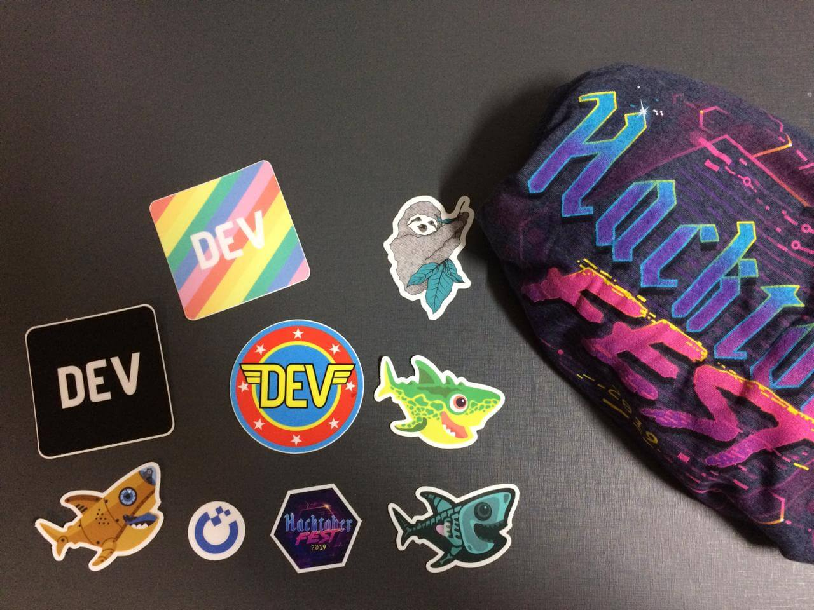
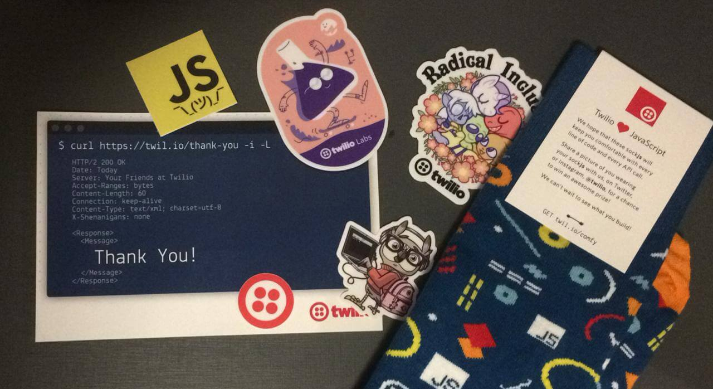

Anualmente em Outubro a Digital Ocean organiza o [Hacktoberfest](https://hacktoberfest.digitalocean.com) para movimentar a comunidade open source, este evento é focado em pessoas que estão iniciando a contribuição em projetos abertos, porém qualquer um pode participar.

## O que é o Hacktoberfest

É um evento que acontece todo ano durante o mês de Outubro (October), a iniciativa visa trazer desenvolvedores de todos os níveis para participar de projetos da comunidade open source. Uma grande quantidade de pessoas se mobilizam neste mês para contribuir com o evento. Por sinal diversas empresas atrelam o mesmo mês para terem seus próprios Hacktober.

A edição de 2020 já está online e sua inscrição pode ser feita pelo site do [Hacktoberfest](https://hacktoberfest.digitalocean.com/)

## Por que participar?

Em primeiro lugar pelo aprendizado, você pode interagir com desenvolvedores de todo o mundo para tirar dúvidas, discutir, aprender e contribuir. A opção de participar em projetos de grandes empresas pode lhe dar uma confiança e deixar o seu Github mais profissional. E além disso a Digital Ocean e seus parceiros enviam prêmios como camisetas, licenças em programas, adesivos e surpresas para todos que participarem e cumprirem os requisitos da edição vigente.

## Como participar?

Para fazer parte do Hacktoberfest você primeiramente precisa ter uma conta no [GitHub](https://github.com/), ele será necessário para que você atrele sua conta ao site da empresa que está organizando o evento e eles possam conferir suas contribuições. Identifique o site da Hacktoberfest e faça seu login atrelando sua conta do github ao perfil da hacktoberfest. Pronto, basta contribuir com repositórios públicos no github para começar a contar. Normalmente o mínimo de pull request solicitados é entre 2~5, então é bem tranquilo para qualquer pessoa participar.

Resumindo, como participar do Hacktoberfest:

- Crie uma conta no [GitHub](https://github.com/join)
- Acesse o site da [Hacktoberfest](https://hacktoberfest.digitalocean.com)
- Atrele sua conta do Github ao site da Hacktoberfest
- Procure [issues abertas](https://github.com/search?q=label%3Ahacktoberfest+state%3Aopen+no%3Aassignee+is%3Aissue&type=Issues) no Github
- Contribua e faça seus pull request

## Como funciona um projeto open source?

Um open source é resumidamente um projeto criado e mantido pelas pessoas que o utilizam. Digamos que você tenha um campo de futebol open source perto de sua casa, uma pessoa vai ajudar a cortar a grama, outra ajuda a pintar as marcações, outro ajuda a regar, mais alguém trás a bola e todos podem jogar! É um sistema colaborativo de crescimento de software.

Contribuir para o open source pode ser uma maneira gratificante de aprender, ensinar e construir experiência em praticamente qualquer habilidade que você possa imaginar.

Além de tudo isso você pode interagir com profissionais reais do mercado e consultá-los para tirarem suas dúvidas, fazerem análise de código e darem dicas para você melhorar.

Recomendo que você veja o site [Open Source Guides](https://opensource.guide/pt) para ter um conhecimento mais aprofundado da iniciativa open source.

## Encontrando projetos para participar

Existem issues (tarefas a serem feitas) listadas no GitHub que você pode procurar e fazer parte. O site [Swag List](https://hacktoberfestswaglist.com/) reúne diversas empresas que estão premiando e fazendo parte do evento com Issues de seus projetos, isso mesmo, você pode ganhar prêmios da Digital Ocean e de mais diversas outras empresas como Adobe, Globo, Twilio.

## Conclusão

Ajudar a comunidade é um ótimo meio para aprender, interagir e crescer produtos que você utiliza no seu dia-a-dia. O Hacktober é um evento para acelerar e incentivar esta iniciativa, porém tente não parar nos limites do evento, avance e seja melhor. Com certeza a comunidade pode lhe ajudar em algo, dar uma dica, indicar um livro ou tirar uma dúvida. Se eu puder ajudar em algo é só comentar ou me chamar no [Twitter](https://twitter.com/iaurg).

Valeu 🖖

## Atualização 01/2020

E claro que após participar as suas recompensas chegam:
Itens que ganhei da Digital Ocean e da Dev.to no Hacktoberfest de 2019Itens que ganhe da Twilio no Hacktoberfest de 2019
