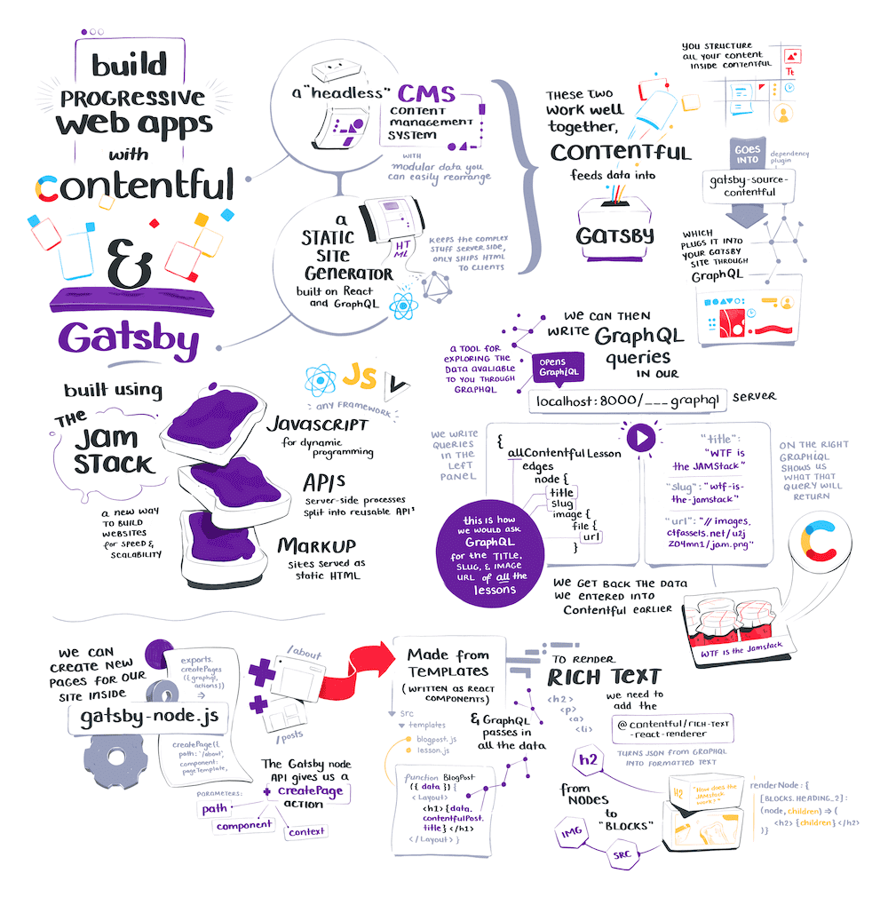

O [**Gatsby**](https://www.gatsbyjs.com) é um framework que reúne as melhores funcionalidades do React  e outras diversas ferramentas modernas em um mesmo pacote, facilitando a criação de sites e aplicações web incrivelmente rápidos e poderosos. **Gatsby** é um SSG (Static Site Generator) grátis e de código aberto baseado em [React](https://pt-br.reactjs.org) que utiliza o GraphQL para consumir dados como principal diferencial. Com foco em tornar o desenvolvimento de sites divertido e eficiente.

Com o **Gatsby.js** você pode desenvolver em React e quando fizer o "build" de seu código ele irá gerar arquivos estáticos que serão acessados pelos usuários. Isto traz diversas vantagens para seus sites como suporte a SEO, uma velocidade incrível, sistema de cache, e diversos outros itens que você pode comparar [nesta página](https://www.gatsbyjs.com/features). A comunidade do Gatsby oferece diversos plugins e sites pré-desenvolvidos para que você possa iniciar seu projeto com meio caminho andado.

Caso queira iniciar seu desenvolvimento em **Gatsby** recomendo o [curso completo sobre Gatsby do Willian Justen](https://www.udemy.com/course/gatsby-crie-um-site-pwa-com-react-graphql-e-netlify-cms/?couponCode=PROMOSET20), este material irá auxiliar você em toda a estrutura e ecossistema do Gatsby.

## Como o Gatsby funciona

Encontrei essa ilustração da [Maggie Appleton](https://illustrated.dev/contentful-gatsby) que resume um pouco o funcionamento do Gatsby e o conceito de [JAMStack](https://jamstack.org/), creio que dê para aproveitar no contexto desse conteúdo.
JAMStack, Gatsby & Contentful

## Porque precisei usar Gatsby?

Bem, eu estava desenvolvendo um sistema utilizando o [create-react-app](/para-que-serve-o-create-react-app/), porém o SEO era extremamente necessário neste caso, e só fui descobrir que o CRA não tem uma boa compatibilidade com o Crawler do Google na hora do deploy, uma tragédia né? Como o create-react-app trabalha principalmente com CSR (Client Side Rendering) ele não consegue uma boa indexação pois quando o bot do Google acessa o site ele teoricamente não "existe" o que dificulta na indexação de algumas páginas.

Basicamente o fluxo que o crawler estava fazendo era: Acessa o site > O site solicita informações da API > As informações são dispostas na tela > Indexa a página > o crawler não visualiza nenhum link ou páginas extras > sai do site, assim a única página indexada era a home (index), as páginas restantes simplesmente não existiam para o Google.

Tentei de diversas maneiras fazer o SEO funcionar com CSR, porém não obtive sucesso. Talvez por falta de experiência ou não há uma forma eficiente até o momento.

A escolha do Gatsbyjs nessa situação foi para poder aproveitar a vantagem de SEO, e acabei me beneficiando de diversas outras vantagens dessa ferramenta, como a oportunidade de trabalhar com tecnologias mais modernas e novas para mim.

O SEO funciona com o Gatsby pois todas as páginas do site já estão criadas no servidor, sempre que você faz o processo de build no Gatsby ele cria todas as páginas do site e deixa elas prontas para serem acessadas, com todo o conteúdo gerado. Então quando o crawler do Google vier em seu site todo o conteúdo estará disposto para que ele possa ler.

E o melhor de tudo é que você ainda pode usar os recursos do React para popular ou gerenciar componentes no front-end.

## Gatsby.js ou Next.js?

Provavelmente você acabará chegando a esta pergunta. Aqui no blog tenho um artigo explicando sobre [o que é e como funciona o Next.js](/o-que-e-next-js/), talvez ele possa lhe ajudar na sua compreensão.

Um ponto que deve ser compreendido é que o Gatsby precisa rodar uma build para gerar todas as páginas do site e depois você deixa elas online, super rápidas e eficientes.

É uma abordagem interessante, mas atente-se a um ponto: E se você quiser atualizar alguma informação nas páginas geradas?  Precisará rodar a build novamente para atualizar informações dispostas nos elementos.

Uma solução para evitar essa build constante é o [client-data-fetching](https://www.gatsbyjs.org/docs/client-data-fetching/) mas isso faz com que seu site seja um sistema React normal, Axios -> retornar informações da api -> popula os components. É interessante se algumas páginas utilizarem desse recurso, porém se todo o site precisa disso você perde algumas funcionalidades do Gatsby e dependendo de como for estruturado esse fetch o crawler do Google não conseguirá ler as informações a tempo, e resultará em perda de SEO.

E esse ponto é crítico caso você precise atualizar muitas ~imagine muiiiiitas~ páginas que já estão geradas e então precisa fazer build novamente, e uma build muito grande no Gatsby leva alguns minutos...

A comunidade do Gatsby vem discutindo sobre este ponto de gerar build com muitas páginas, se quiser acompanhar é só acessar a [issue no Github](https://github.com/gatsbyjs/gatsby/issues/19512)

> Me trying to build a Gatsby website with 36K pages. Bad idea! [pic.twitter.com/j0OKNVFKNr](https://t.co/j0OKNVFKNr) > &mdash; Greg Bergé (@neoziro) [November 22, 2019](https://twitter.com/neoziro/status/1197894647248490497?ref_src=twsrc%5Etfw)

A atualização de um sistema desta maneira fica improdutiva e consome muito recurso. E neste caso o NextJS pode atender melhor suas necessidades veja alguns videos como:

Creio que prestando atenção nesses vídeos você consegue diferenciar qual a necessidade de seu projeto. Resumidamente:

### GatsbyJS

- Arquivos estáticos gerados na build: Todo o site estará disponível em HTML/CSS/JS após a build em uma pasta de itens estáticos que já consumiram as informações do GraphQL na geração de seu conteúdo.
- Normalmente é necessário rodar a build novamente para atualizar itens ou criar novos posts/páginas. _Se souber alguma forma eficiente de fazer isso me ensine nos comentários ou no [twitter](https://twitter.com/iaurg)_
- SEO e Velocidade impecáveis: Como o site já está "pronto" o acesso dos usuários e motores de busca acontece em uma velocidade incrível
- Simplicidade no desenvolvimento: A documentação e forma de desenvolver o projeto é muito bem conduzida, além de diversos plugins oficiais que facilitam em muitos pontos.
- GraphQL para consumir os dados: Nunca tinha utilizado o GraphQL e no Gatsby fui "forçado" a utilizar e confesso que gostei bastante, uma sintaxe limpa, comandos didáticos e um painel para testar consultas.

O **Gatsby** é responsável por gerar conteúdo estático (Static Site Generator), que segue o fluxo ilustrado abaixo:

### NextJS

- Arquivos estáticos que não possuem getInitialProps são gerados na build e arquivos dinâmicos são renderizados pelo servidor (SSR) na primeira consulta. Essa funcionalidade foi lançada enquanto eu batia a cabeça com um projeto em julho/19 ([Automatic Static Optimization](https://nextjs.org/blog/next-9#automatic-static-optimization))
- Complexidade no desenvolvimento: Em algum momento você irá esbarrar em algo que exige mais conhecimento na parte de servidor (back-end) para que consiga gerar recursos mais eficientes, neste quesito o Gatsby é muito mais simples. Por exemplo, como gerar um sitemap no SSR?
- A velocidade do site em um geral é extremamente rápida e a parte de SEO pode ser simplificada com alguns pacotes da comunidade como [next-seo](https://github.com/garmeeh/next-seo)

O fluxo principal do **Next.js** é Server Side Rendering (apesar de atualmente também fazer SSG), que segue o fluxo abaixo:

Tanto o Gatsby quando o Next são ótimas ferramentas de trabalho, geram sites muito rápidos e eficientes, porém possuem finalidades bem distintas.

Para entender a diferença dos dois eu errei, então espero que meu erro possa servir de exemplo para que você aprenda e entenda a sua real necessidade. E o erro não foi de todo mal, agora eu sei desenvolver em GatsbyJS e NextJS 😂

Se tiver alguma dúvida ou sugestão é só comentar abaixo!

Tradução de termos e glossário:

**Build:** Neste caso é a "compilação" do site, esse processo disponibiliza uma pasta com os arquivos prontos para integrar a versão oficial do site. Normalmente é realizado após um comando no terminal como: "gatsby build" - Gatsby.js, "next build" - NextJS ou "npm run build" - Create React App.

**Crawler**: Mecanismo de um buscador que escaneia sites para identificar o conteúdo de uma página e relacionar com as buscas que são feitas.

**Static Site Generator (SSG)**: Gerador de site estático, uma ferramenta que gera arquivos de um site prontos para serem acessados pelo usuário, normalmente sem a necessidade de uma consulta ao servidor.

**Search Engine Optimization (SEO)**: Otimização de um site e seu conteúdo para aparecer em posições superiores de buscadores, atualmente no Brasil o maior foco é no Google.

**Create React App (CRA)**: É um facilitador para a criação de sites utilizando a biblioteca React, permite que você inicie um novo projeto em React com o mínimo de configurações.

**React**: Uma biblioteca JavaScript para criar interfaces de usuário.

Quer **participar de um projeto open source**? Ajude-nos a [traduzir a documentação do Gatsby para Pt-BR](https://github.com/gatsbyjs/gatsby-pt-BR), você será muito bem vindo!

Até mais.
